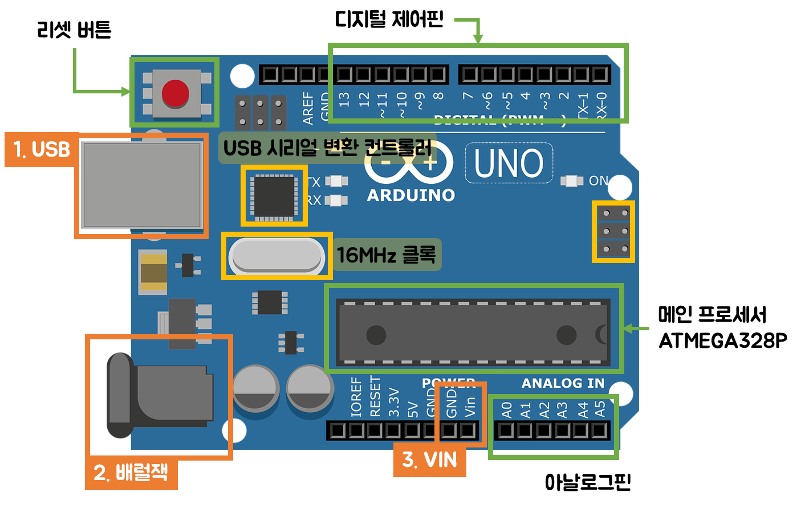

# Arduino Uno

## Arduino

아두이노란, 마이크로컨트롤러 보드와 소프트웨어 개발환경까지 함께 이르는 말이다.

> Q) 마이크로컨트롤러에는 `AVR`과 `ARM`이 대표적으로 있는데 아두이노가 필요한 이유는 무엇일까?
>
> A) 빠른 시간에 쉽게 마이크로컨트롤러 기반의 하드웨어 제어 장치를 만들 수 있도록 해준다.

### Arduino Uno

아두이노 우노는 다른 마이크로컨트롤러 보드에 비해서도 성능이 낮지만 **`오픈 소스`**라는 큰 장점이 있다.

오픈 소스로 구성되어 있기 때문에 공개된 사양을 바탕으로 손쉽게 새로운 기능을 추가하여 기존 기능을 변경하여 사용할 수 있다.

> 아두이노는 2005년 이탈리아 밀라노 옆에 위치한 이브레아(Ivrea)에서 예술가, 디자이너 및 학생들이 쉽게 사용할 수 있는 저렴한 컨트롤 장치를 만들 수 있도록 하기 위해 시작되었다.
>
> 프로젝트를 시작한 마시모 밴지(Massimo Banzi)와 데이비드 쿠아르티에예스(David Cuartielles)는 이 마을의 역사적 인물인 이태리의 왕 'Arduin of Ivrea'에서 그 이름을 따왔다고 한다.

구글이 2011년 아두이노를 하드웨어 파트너로 선택하였다. 이는 아두이노의 오픈 소스인 점과 확장성과 편리성이 있음을 인정하였기 때문이다.

아두이노 우노는 2011년 12월에 나온 R3버전이 최신 버전입니다. 현재도 공식 사이트에서는 R3버전을 판매하고 있습니다. <small>(현재: 2021.08.11)</small>

아두이노 우노 보드는 ATmega328 마이크로컨트롤러를 중심으로 외부 장치 연결을 위한 핀 헤더, 전원 연결 잭, 프로그램 다운로드를 위한 USB 커넥터, 부트로더와 프로그램 다운 로드를 위한 ISP 연결 커넥터 등으로 구성되어 있다.

| 항목             | 내용      | 비고                      |
| ---------------- | --------- | ------------------------- |
| 마이크로컨트롤러 | ATmega328 |                           |
| 동작 전압        | 5V        |                           |
| 입력 전압        | 7~12V     | 추천 입력 범위            |
| 디지털 입출력 핀 | 14개      | 6개 PWM 출력 핀           |
| 아날로그 입력 핀 | 6개       |                           |
| 플래시 메모리    | 32KB      | ATmega328, 부트로더 0.5KB |
| SRAM             | 2KB       | ATmega328                 |
| EEPROM           | 1KB       | ATmega328                 |
| 클록 주파수      | 16MHz     |                           |

### 아두이노 우노의 장점

1. 저렴한 가격

2. 다양한 운영체제 지원

   > 대부분의 마이크롤컨트롤러 시스템이 윈도우만 지원하는데 비해 아두이노는 우니동, 매킨토시 OS X, 리눅스을 지원한다.

3. 쉽고 간단한 프로그래밍 환경

4. USB 지원

5. 오픈 소스 소프트웨어

6. 오픈 소스 하드웨어

7. 다양한 쉴드와 센서모듈

### 아두이노 공식 보드

| 보드                | 마이크로 컨트롤러      | 디지털 핀 수 | PWM 핀 수 | 아날로그 핀 수 | 클록(MHz) | 플래시 메모리(KB) | 기타                                                         |
| ------------------- | ---------------------- | ------------ | --------- | -------------- | --------- | ----------------- | ------------------------------------------------------------ |
| 아두이노 우노       | ATmega328              | 14           | 6         | 6              | 16        | 32                |                                                              |
| 아두이노 미니       | ATmega328              | 14           | 6         | 8              | 16        | 32                | - 소형 아두이노 모드 - USB연결 커넥터 없음              |
| 아두이노 나노       | ATmega328              | 14           | 6         | 8              | 16        | 32                | - 아두이노 미니 보드에 브레드보드 장착용 핀과 USB 연결 커넥터 추가 |
| 릴리패드 아두이노   | ATmega328V             | 14           | 6         | 6              | 8         | 16                | - 입는 컴퓨터 개발을 위한 원형 아두이노 보드                 |
| 아두이노 레오나르도 | ATmega32u4             | 20           | 7         | 12             | 16        | 32                | - USB 통신 기능이 내장된 ATmega32u4 사용                     |
| 아두이노 마이크로   | ATmega32u4             | 20           | 7         | 12             | 16        | 32                | - USB 통신 기능이 내장된 ATmega32u4 사용 - 소형 아두이노 보드 |
| 아두이노 윤         | ATmega32u4             | 20           | 7         | 12             | 16        | 32                | - USB 통신 기능이 내장된 ATmega32u4 사용 - 이더넷 전용의 리눅스 기반 Atheros AR9331 프로세서를 함께 사용 |
| 아두이노 메가2560   | ATmega2560             | 54           | 15        | 16             | 16        | 256               | - ATmega2560 사용으로 많은 수의 입출력 핀 제공               |
| 아두이노 메가ADK    | ATmega2560             | 54           | 15        | 16             | 16        | 256               | - 아두이노 메가2560에 구글 ADK지원을 위한 USB 호스트 기능 추가 |
| 아두이노 두에       | SAM3X8E(ARM Cortex-M3) | 54           | 12        | 12             | 84        | 512               | - 32비트 마이크로컨트롤러 사용                               |

아두이노 두에를 제외한 아두이노 보드들은 8bit 마이크로컨트롤러를 사용하고 있다. 따라서 연산량이 많은 경우, 빠른 연산을 필요로 하는 경우, 고속의 데이터 전송을 요하는 경우에는 아두이노가 적합하지 않다.

