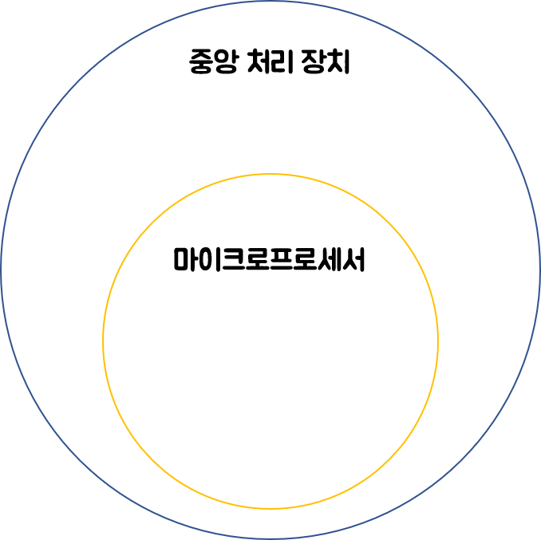

# 마이크로컨트롤러, MCU

제어 장치 제작을 목적으로 중앙 처리 장치에 입출력 및 메모리 장치를 포함하여 하나의 칩으로 구현한 마이크로프로세서의 일종이다.

## 마이크로프로세서란?

먼저 컴퓨터의 구조를 보자.

컴퓨터는 연산의 핵심이 되는 연산 장치와 연산을 제어하는 제어 장치로 이루어지는 중앙 처리 장치(CPU, Central Processing Unit), 데이터 입출력을 위한 입출력 장치, 데이터 저장을 위한 주기억 장치 및 보조기억 장치 등으로 구성된다.

집적회로 기술의 발달에 힘입어 소형화와 경량화가 이루어졌고 중앙처리 장치는 하나의 칩으로 구현이 가능하게 되었다. 이처럼 `컴퓨터의 중앙 처리 장치를 하나의 IC(Integrated Circuit)로 집적시켜 만든 반도체 소자`를 **마이크로프로세서**라고 부른다.

마이크로프로세서는 중앙 처리 장치의 여러 형태 중 한 가지로 모든 마이크로프로세서는 중앙 처리 장치이지만, 모든 중앙 처리 장치가 마이크로프로세서인 것은 아니다.

